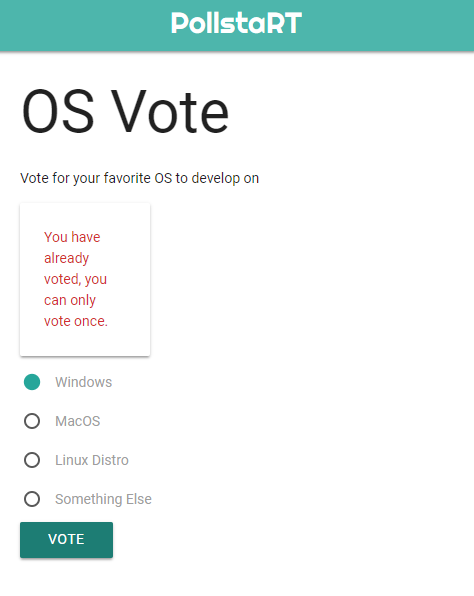
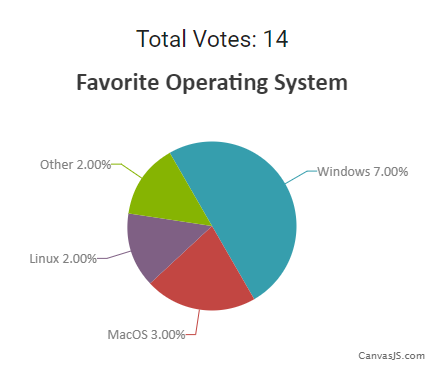

# PollstaRT

## Overview
Full Stack application that allows real time voting and updating using web sockets. Cast your vote and in realtime, results are updated with pie chart displaying the distribution. Users cannot not perform repeated votes.

## Tools Used
1. Node.js
2. Express.js
3. Mongoose
4. Pusher
5. body-Parser
6. Canvas.js
7. Local Storage

## DEMO
[https://pollstart.herokuapp.com/](https://pollstart.herokuapp.com//)
